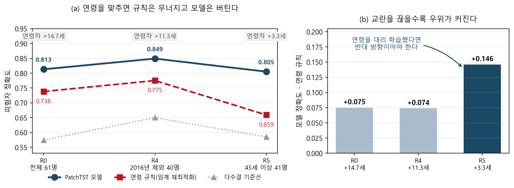
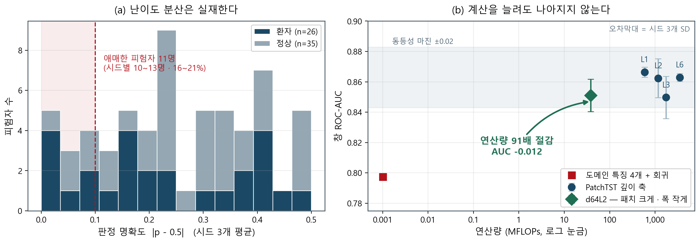
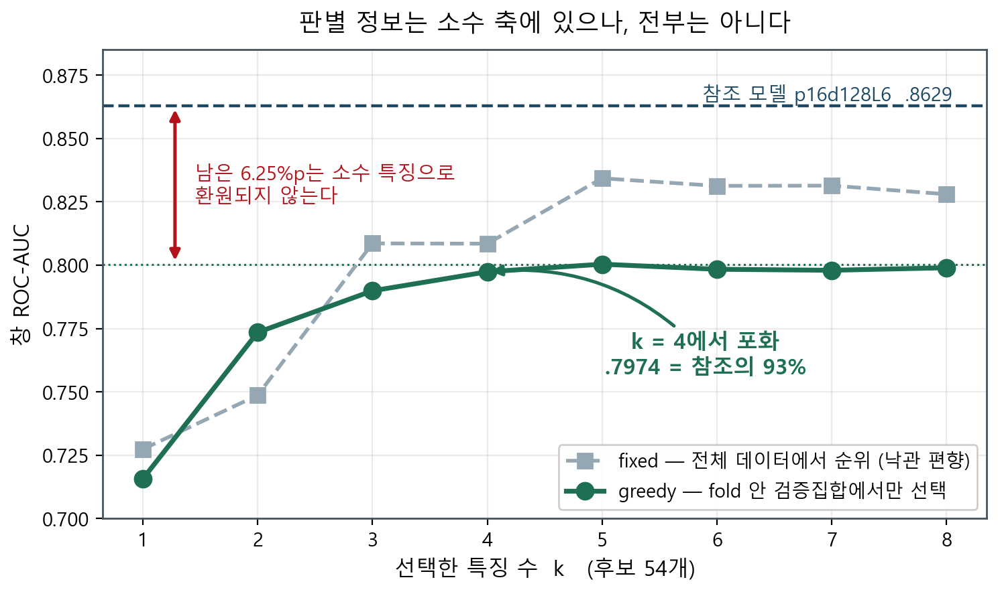
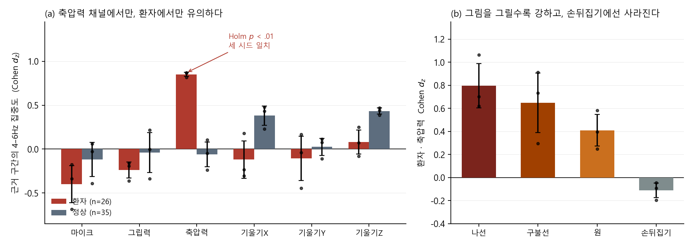

# 파킨슨 필기 스크리닝에 무거운 모델은 필요 없다
### 계산을 입력별로 배분하지 말고, 표현을 바꿔라

---

## 초록

필기 신호 기반 파킨슨 스크리닝에서 **38 MFLOPs 모델이 노트북 CPU 코어 하나로 2초
신호를 7.8ms에 처리하며 창 ROC-AUC .851을 낸다.** 3,499 MFLOPs 참조 모델보다
연산량이 91배 적고 손실은 0.012로, 사전 등록한 동등성 마진 0.02 안이다.

계산을 줄이는 축은 동적(Early Exit)·정적(층·폭·패치)·표현(도메인 특징) 셋이며,
이 중 동적 축만 검증되지 않은 전제 — 입력마다 필요한 계산량이 다르다 — 위에 선다.
이 전제를 조건으로 형식화해 깊이·사람·시간 세 방향에서 측정했다. **전제는
성립하나**(애매한 피험자 16~21%, 절감의 이론적 여지 98.5%, 종료 신호 r = +0.34)
**방법은 실패한다.** 층을 6배 쌓아도 어려운 피험자는 구제되지 않고, 증거를 더 모으면
더 빨리 확신 있게 오분류한다. 원인은 난이도 분산의 부재가 아니라 **난이도와 계산량
요구가 서로 다른 것**이며, 특징 4개가 참조 모델 성능의 93%를 설명한다는 관측이
이를 뒷받침한다.

이 데이터셋은 연령 규칙만으로 73.8%가 맞을 만큼 교란이 심하다. 연령을 매칭하면
연령 규칙은 .738 → .659로 무너지는 반면 모델은 .805를 유지해 **우위가 +.075에서
+.146으로 증가한다.** 측정 연도와 기록 경계를 제거해도 성능이 유지된다. 설명
분석에서는 6채널 × 2군 12개 검정 중 **환자의 축압력 채널에서만** 모델의 근거
구간에 떨림 대역(4~6Hz)이 유의하게 몰리고(순열 검정 · Holm 보정 후 *p* < .01 ·
세 시드 일치), 정상군에서는 귀무가 유지된다.

---

## 1. 서론

필기 기반 파킨슨병 스크리닝은 저비용 선별 검사로 주목받아 왔고, 온디바이스
배포를 염두에 두면서 계산량 축소가 함께 다뤄진다. 축은 셋이다 — **동적**(Early
Exit: 쉬운 입력은 얕은 층에서 종료), **정적**(층·폭·패치 축소), **표현**(도메인
특징 + 경량 ML).

동적 축만 전제를 요구한다. **입력 간 예측 난이도에 유의한 분산이 존재해야**
계산을 차등 배분할 대상이 생긴다. 그런데 이 전제는 검증되는 일이 드물다.
가정 위에서 방법이 제안되고, 가정 자체는 확인되지 않은 채 지나간다.

이 논문은 그 전제를 조건으로 명시하고 세 방향에서 실제로 검증한다. 그리고
조건이 성립하는데도 방법이 실패하는 이유를 찾는다.

**데이터** NewHandPD[1] 스마트펜 6채널(1000Hz), 과제 4종. 파일번호는 66개지만
`Person_ID_Number`로 세면 **고유 인물은 61명**이다(정상 35 / 환자 26). 중복 4건과
인물 혼입 1건이 있어, 파일번호로 분할하면 같은 사람이 학습·평가 양쪽에 들어간다.
우리는 인물 단위로 분할했다. 2초 × 50% 겹침으로 13,474 윈도우를 만들었다.

**모델·평가** PatchTST[8] 분류기(RevIN[9] 정규화 포함), 피험자 단위 GroupKFold, 시드 42·1·7. 주 지표는
창 ROC-AUC다(피험자 정확도는 1명이 1.64%p로 노이즈가 효과보다 크다).

**기여**

1. **배포 가능한 결론.** 38 MFLOPs · 7.8ms · AUC .851 — 참조 모델 대비 91배 절감에
   손실 0.012(§6). 이론 FLOPs 91배가 실측에서 49배로 줄어드는 것도 함께 보인다.
2. **그 결론에 이르는 축 선택의 근거.** Early Exit 성립 조건을 형식화하고 깊이·
   사람·시간 세 방향에서 검증해, 실패 원인을 **난이도–계산량의 비연결**로 특정한다(§3–§4).
3. **교란 통제 프로토콜.** 연령·측정 연도·기록 경계라는 세 지름길을 각각 끊고
   각 조건에서 기준선을 재최적화해 비교한다(§2).
4. **근거의 임상적 검증.** occlusion 근거 구간에 떨림 대역이 몰리는지를 순열 검정으로
   재고, 정상군에서 귀무가 유지됨을 함께 보인다(§5).

---

## 2. 교란 통제

이 데이터셋은 **2016년 측정 21명이 전원 정상**이고 정상군이 환자군보다 평균
14.7세 젊다. **나이 하나로 자르는 규칙만으로 73.8%가 맞는다**(임계 53세). 모델이
넘어야 하는 선은 다수결 57.4%가 아니라 73.8%다.

두 교란을 각각 제거한 부분집합에서 재학습했다. 비교 기준인 연령 규칙에는
**각 부분집합에서 임계값을 다시 최적화해** 최선의 조건을 준다. 고정 임계를 쓰면
부분집합에서 규칙이 불리해져 우리 모델의 우위가 과장된다(R4에서 .725 대 .775).

**표 1.** 교란 통제 조건별 성능. 연령 규칙은 각 조건에서 임계값을 재최적화했다.

| 조건 | 인원 | 연령차 | 연령 규칙 (임계) | 모델 (피험자 정확도) | **모델 − 규칙** |
|---|---:|---:|---:|---:|---:|
| R0 전체 | 61 | +14.7세 | .738 (53세) | .813 | +.075 |
| R4 2016년 제외 | 40 | +11.3세 | .775 (48세) | .849 | +.074 |
| **R5 45세 이상** | 41 | **+3.3세** | **.659 (53세)** | .805 | **+.146** |

세 조건은 모두 **동일한 d64 계열 백본**(patch 100/50 · d64)에서 3-fold · 시드
42/1/7로 학습했다. 조건 사이의 비교만을 목적으로 하며, §6의 절대 성능표(5-fold)와
직접 비교하지 않는다.

연령차를 3.3세로 좁히면 연령 규칙은 .659로 떨어져 다수결(.585)에 가까워지는데
**모델은 .805를 유지한다.** 규칙 대비 우위가 두 배가 된다.

> **모델이 연령을 대리 학습했다면 반대 방향이 나와야 한다.** 연령 정보가
> 사라졌을 때 모델도 함께 무너져야 하는데 상대적 우위가 오히려 커진다.

**다른 백본에서 재현된다.** 위 표는 `p16d128` 계열에서 얻은 것이다. 같은 절차를
§6의 배포 모델 `d64L2`(patch 100/50 · d64 · L2)에 그대로 적용했다.

**표 2.** 배포 모델 `d64L2`(patch 100/50 · d64 · L2)에서의 재현.

| 조건 | 연령 규칙 | 다수결 | 모델 | **모델 − 규칙** | 창 AUC |
|---|---:|---:|---:|---:|---:|
| R0 전체 | .738 | .574 | .819 | +.081 | .8434 |
| R4 2016년 제외 | .775 | .650 | .833 | +.058 | .8511 |
| **R5 45세 이상** | **.659** | .585 | **.837** | **+.178** | .8370 |

같은 방향이 더 크게 나온다. 우위가 **+.081 → +.178로 두 배 이상** 벌어지고,
연령을 맞춘 R5에서 모델의 피험자 정확도는 오히려 **오른다**(.819 → .837).
창 AUC 차이는 −.0064로 동등성 마진 0.02의 32%다.

교란 관문을 통과한 모델과 설명 분석(§5) 및 배포 결과(§6)의 모델은 동일한
`d64L2`다.

창 AUC 자체도 R5에서 .822로 전체(.826)와 사실상 같다(차이 −.004, 사전 등록한
동등성 마진 0.02의 21%). 성별 단독 규칙은 57.4%로 다수결과 같아 추가 지름길이
아니다.

세 번째 의심은 **측정 아티팩트**다. 각 기록의 시작·종료 구간에는 펜을 들고
내려놓는 준비 동작이 섞이므로, 모델이 질환이 아니라 이 경계를 학습했을 수 있다.
각 기록의 첫 창과 마지막 창을 지우고(13,474 → 11,890창, 피험자 61명 유지)
재학습하자 창 AUC는 **.8664 → .8691로 오히려 유지**됐다(시드 3개).

**그림 1.** (a) 연령차가 +14.7세에서 +3.3세로 좁혀지면 연령 규칙은 .738 → .659로
다수결에 가까워지는데 모델은 .813 → .805로 평평하다. (b) 그 결과 모델의 규칙 대비
우위는 +.075에서 +.146으로 **두 배가 된다.**

연령·측정 연도·기록 경계라는 세 지름길을 각각 차단해도 성능이 유지된다. 어느
하나도 단독으로 결정적이지는 않으나 **세 결과가 같은 방향을 가리킨다.**

**검출 한계.** 서브셋은 fold가 3개뿐이라 구간이 넓다(R5 AUC 95% CI
[.649, .995]). "성능 유지가 통계적으로 확인됐다"가 아니라 **"±0.15 규모의 변화는
이 표본에서 검출하지 못한다"**가 정확하다. 경계 창 제거는 학습량도 함께 줄이므로
아티팩트 의존이 **완전히 없음**을 확정하지는 않는다.

---

## 3. Early Exit 성립 조건의 검증

> **조건** 입력 간 예측 난이도에 유의한 분산이 존재할 것.

**그림 2.** (a) 피험자별 판정 명확도(시드 3개 평균). 판정이 애매한
(|p − 0.5| < 0.1) 피험자가 **11명**이고 시드별로는 10~13명(16~21%)이다 —
**난이도 분산은 실재한다.** (b) 연산량과 성능. 깊이를 6배 늘려도 AUC가 개선되지
않으며, 패치를 키우고 폭을 줄인 모델이 91배 적은 연산으로 동등성 마진 안의 성능을
낸다. 오차막대는 시드 3개의 표준편차다.

### 3.1 깊이 축

같은 백본에서 층 수만 바꿔 독립 학습했다(4종 × 시드 3개). 창 AUC는 L1 .8664 ± .003,
L6 .8629 ± .002로 **연산 6배에 개선이 없다**(차이 −0.35%p로 깊은 쪽이 오히려 낮고,
사전 등록한 동등성 마진 0.02의 18%이며 시드 변동 ±.011보다 작다). 신뢰구간이 넓어
정확히는 "차이가 없다"가 아니라 **"이 표본에서 검출할 수 있는 크기가 아니다"**이다.
과적합 간극은 층 수에 따라 단조 증가해(0.52 → 0.92) 추가 용량이 일반화가 아니라
암기에 쓰임을 시사한다.

얕은 출구 강화, 확신도 미사용(PABEE), 임계값 21개 스윕 모두 곡선 모양을 바꾸지
못했다. 공동 학습 없이 층만 늘린 정적 대조군에서도 같으므로 **원인은 공동 학습이
아니라 깊이 자체**다. τ = 0.50에서 평균 종료 출구가 정확히 1.00으로, **선택적
라우팅 자체가 관측되지 않는다.**

### 3.2 사람 축

시드 3개에서 모두 틀리는 피험자가 2명, 2/3 시드 4명, 1/3 시드 6명이다. 그런데
L1 ↔ L6에서 순이득은 3명이고 피험자 확률은 평균 0.083밖에 움직이지 않는다.
**3/3으로 틀리는 2명은 L1에서도 L6에서도 틀린다.**

### 3.3 시간 축

피험자마다 창 증거를 누적해 판정에 필요한 관측량을 추정했다(축차확률비검정[11]의 Wald 근사). 층 단위 조기 종료는 PABEE[10] 계열의 인내 기반 규칙을 따랐다.

**표 3.** 시간 축 조기 종료의 성립 조건.

| 조건 | 판정 | 값 |
|---|:--:|---|
| 절감 여지가 있는가 | O | 이론 상한 98.5% |
| 난이도 분산이 있는가 | O | 명확도 상하위 4.8배, 분포가 단봉 아님 |
| 멈출 신호가 있는가 | O | 드리프트 ↔ 정확도 r = +0.34 (p = .007) |
| **오류를 통제할 수 있는가** | **X** | **확신을 갖고 틀리는 피험자 8명** |

확신 오분류 8명 중 7명이 환자다. 필요 관측량이 2.6인데 그 답이 틀린다 —
**적응적 종료를 붙이면 더 빨리, 더 확신 있게 틀린다.** 사전확률 보정을 −3~+4로
훑어도 이 인원이 줄지 않고 온도 보정은 부호를 바꾸지 않으므로,
**캘리브레이션으로 해결되는 문제가 아니다.**

### 3.4 종합

세 방향 모두 같은 형태다 — **메커니즘은 작동하는데 어려운 사람에게 듣지 않는다.**
깊이는 층을 더 쌓을 수 있지만 그들은 구제되지 않고, 시간은 더 오래 볼 수 있지만
그들은 더 빨리 확신 있게 틀리며, 사람 축에는 난이도 차이가 있지만 그 차이가
계산량과 연결되지 않는다.

따라서 Early Exit의 실패는 난이도 분산의 부재가 아니라 **난이도와 계산량 요구가
서로 다른 것**에서 온다. 더 계산해서 나아지는 표본과 실제로 어려운 표본이 같은
집합이 아니다.

---

## 4. 판별 정보의 차원

조건이 성립하는데도 방법이 실패하는 이유를 **특징 공간에서** 찾았다. 대역별 파워
4종(저주파 0.5~4 · 떨림 4~6 · 중주파 6~12 · 고주파 12~50Hz) × 6채널, 속도·가속도·
진폭의 표준편차, 첨도, 정지 시간 비율 — **후보 54개**를 만들어 전진 선택했다.

**선택 편향을 두 방식으로 갈라 함께 보고한다.** 전체 데이터에서 단일 성능 순위를
매겨 고르면(`fixed`) 그 순위 자체에 평가집합 정보가 새어 든다. `greedy`는 **fold 안
검증집합에서만** 고른다. 두 곡선을 함께 싣는 이유는, `fixed`가 k = 5에서 .8343까지
올라가 참조 모델과의 격차를 2.9%p로 좁히지만 **그 값을 결론의 근거로 쓸 수 없기
때문**이다. 아래 논의는 전부 `greedy` 기준이다.

**그림 3.** 편향 없는 `greedy` 곡선은 **k = 4에서 포화한다**(.7974). 5~8개에서
.7980~.8004 사이를 오갈 뿐이고 피험자 AUC는 오히려 내려간다(.9053 → .8979).
`fixed`가 더 높은 구간은 선택 편향의 크기를 보여준다.

**특징 4개가 참조 모델의 93%를 설명한다.** 모든 입력이 대체로 같은 소수 축으로
판별된다면 "더 계산해야 풀리는 입력"이라는 범주가 잘 서지 않는다. 이것이 3장에서
관측한 비연결의 특징 공간 쪽 설명이다.

**다만 그 축은 떨림 대역이 아니다.** 4~6Hz 대역 파워는 6채널을 다 써도 .6125에
그치고, 단일 특징 최고는 **그립력의 가속도 표준편차(.7274)**다. 단일 성능 상위
8개에 떨림 대역이 하나도 없다. 즉 저차원 축은 **움직임의 변동성과 저주파 성분**이다.

**포화 지점의 잔차는 6.25%p다**(.8004 대 .8629). 이 결과가 뒷받침하는 것은 판별
정보가 **대체로** 저차원이라는 것이지 전부 저차원이라는 것이 아니다. Early Exit의
실패를 설명하기에는 전자로 충분하지만, 남은 6.25%p가 무엇인지는 이 분석으로 답할
수 없다. 그것이 다음 절의 질문이 된다.

한 가지 더 조심할 것이 있다. 여기서 고른 축(가속도 표준편차·저주파 성분)은
**나이와 함께 변하는 양**이다. 이 절의 결과가 연령 교란의 재등장이 아니라는 근거는
이 절 안에 없고, **2장의 관문에 의존한다.**

---

## 5. 설명 분석 — 모델의 근거 구간

저차원성은 "왜 더 계산해도 안 풀리는가"를 설명하지만, "그럼 모델이 아무것도 안
보는가"는 아니다. **모델이 짚는 구간이 임상적으로 말이 되는지**를 직접 확인했다.

**방법.** 학습된 모델을 고정한 채 입력의 1초 구간을 채널별로 지우고(occlusion)
예측 확률이 얼마나 흔들리는지 잰다. 흔들림이 큰 구간이 그 채널의 근거 구간이다.
그 다음 **근거 구간과 나머지 구간의 4~6Hz 상대 파워를 피험자 안에서 비교**한다.
파킨슨 떨림의 임상 대역이 4~6Hz이므로, 근거 구간에 이 대역이 몰린다면 모델이
떨림을 보고 있다는 뜻이다.

세 가지를 통제했다. ① fold의 `test_subjects`로 짝지어 **자기 학습에 쓰인 모델로
자기를 설명하지 않는다.** ② 진폭 차이를 지우려 절대 파워가 아닌 **상대 파워
(대역/전체)** 를 쓴다. ③ 귀무분포를 구간 라벨 **순열 1,000회**로 직접 만들고
채널 6개에 Holm 보정을 건다.

**결과.** 6채널 × 2군 = 12개 검정에서 **환자의 축압력 채널 하나만** 세 시드에서
모두 살아남았다(*d_z* = +0.870 / +0.867 / +0.819, 순열 *z* = +6.06 / +7.93 /
+4.94, Holm *p* = .0008 / .0030 / .0063).

**그림 4.** 점은 개별 시드. (a) 12개 검정 중 환자의 축압력만 살아남는다.
(b) 같은 분석의 과제별 분해.

26명 중 22명이 같은 방향이다. **정상군의 같은 채널은 시드마다 부호가 뒤집히고
보정 후 *p* = 1.0** 으로, 귀무가 성립해야 할 곳에서 정확히 귀무가 나온다.
구간을 평균이 아닌 선형보간으로 채워도 효과가 유지된다(+1.02).

**과제별로 갈린다**(그림 4b). 나선 **+0.80** → 구불선 +0.65 → 원 +0.41 →
손뒤집기 **−0.11**로 순서가 뚜렷하다. **펜 끝이 종이에 그림을 그리는 과제일수록 떨림 근거가 강하고, 손을 뒤집는
과제에서는 사라진다.** 이 순서는 독립적으로 수행한 과제별 분류 실험의 성능
(원 그리기 AUC .408 — 우연 이하)과 방향이 일치한다.

**주의.** 이것은 상관이며 인과가 아니다. 같은 대역을 지우고 **재학습**하면 성능이
회복되므로(AUC .8664 → .8674) 정보는 중복돼 있고, 고정 모델에서도 4~6Hz 제거의
효과는 정답 확률 기준 **환자 +.036 / 정상 −.021** 로 작다. 즉 **모델은 떨림을
보지만 떨림만 보지는 않는다** — 이것이 3장의 저차원성과 모순 없이 맞물린다.

---

## 6. 세 축의 비교

**표 4.** 세 축의 연산량과 성능.

| 구성 | 연산량 | 창 AUC (시드 3개 평균 ± SD) |
|---|---:|---:|
| 참조 모델 `p16d128L6` | 3,499 MFLOPs | .8629 ± .003 |
| 층만 줄임 `p16d128L1` | 588 MFLOPs | .8664 ± .003 |
| **패치↑ 폭↓ `d64L2`** | **38 MFLOPs** | **.8511 ± .011** |
| **특징 4개 + 회귀** | **~0.001 MFLOPs** | **.7974** |

모두 5-fold · 시드 42/1/7의 평균이다. 참조 모델 대비 `d64L2`의 손실은 **−.012**로
동등성 마진 0.02 안이며, `d64L2`의 시드 변동(±.011)과 같은 크기다.

**표 5.** 노트북 CPU 코어 1개, batch = 1에서 측정한 추론 지연.

| 모델 | MFLOPs | 중앙 지연 | p90 | 초당 처리 창 |
|---|---:|---:|---:|---:|
| **`d64L2`** | 38 | **7.8 ms** | 10.7 ms | **128** |
| `p16d128L1` | 588 | 46.7 ms | 52.8 ms | 21 |
| `p16d128L6` | 3,499 | 380.9 ms | 437.8 ms | 2.6 |

**2초 신호를 7.8ms에 처리한다 — 실시간의 256배**이며, 별도 가속기 없이
온디바이스 스크리닝이 가능한 수준이다. 다만 **FLOPs 91배 차이가 실측에서는
49배로 줄어든다.** 이론 연산량만으로 배포 비용을 주장할 수 없다는 근거이며,
깊은 모델일수록 메모리 대역폭이 병목이 되기 때문이다.

`p16d128L1`은 층이 1개인데도 588 MFLOPs다. 패치가 16이라 길이 2,000이 249개
패치로 쪼개지고 어텐션 비용이 패치 수의 제곱으로 붙기 때문이다. `d64L2`는 층이
2개지만 패치가 100이라 39개로 끝나고 폭도 절반이어서 **15배 싸고 손실은 −.015로
동등성 마진 안에 있다.**
이 과제에서 유효한 정적 축은 **깊이가 아니라 패치 길이와 폭**이다.

연산이 극도로 제약되면 표현 축이 참조 성능의 93%를 4만 분의 1 비용에 제공한다.
**이 과제에서 동적 축은 어느 구간에서도 선택지가 되지 못한다.**

---

## 7. 선행 연구와의 비교

같은 데이터셋에서 96~99%를 보고한 논문이 여럿 있다. 우리 수치는 그보다 낮다.
**이 차이는 모델의 우열이 아니라 평가 설계의 차이다.**

NewHandPD는 파일번호가 66개지만 고유 인물은 61명이다(§1). 파일 단위나 이미지
단위로 분할하면 **같은 사람이 학습과 평가 양쪽에 들어간다.** 시험 문제를 미리 본
것과 같아서 성능이 부풀려진다. 우리는 인물 단위로 분할했고, 여기에 연령까지
매칭했다.

**표 6.** 선행 연구의 분할 프로토콜과 보고 성능.

| 연구 | 분할 단위 | 보고 성능 |
|---|---|---|
| 이미지 5-fold 계열 (2025) | 클래스별 샘플 5-fold, 그룹 키 미확인 | 96.97 ± 1.27% |
| 1D-CNN + BiGRU (2020) | 65/10/25, 그룹 키 미확인 | spiral ACC 94.44%, AUC .9825 |
| Albani·Sonbol (2026)[6] | **이미지 단위 5-fold와 LOIO를 직접 비교** | 97.08% · 94.91% |
| Zhang (2025)[4] — 재현 연구 | 원 논문 프로토콜 재현 | spiral 84.03 ± 2.67% meander 79.40 ± 3.52% |
| SVM 기반 (2026) | stratified 10-fold × 10 | 84.06% |
| Zhu (2025)[5] | **NewHandPD를 외부 평가로만 사용** | 76.89% |
| **본 연구** | **인물 단위 GroupKFold + 연령 매칭(R5)** | **창 AUC .851–.866** **피험자 .805–.849** |

표의 항목은 별도로 수행한 문헌 조사(진단 실험 실사용 확인 58건 · 서지 원장
707편)에서 가져왔으며 DOI는 부록에 있다.

**그룹 키가 명시되지 않은 연구는 96~99%대, 재현·외부 평가·
사람 단위가 명시된 연구는 76~84%대에 모인다.** 우리 수치는 후자 구간의 위쪽이며,
거기에 연령 통제까지 얹은 값이다.

분할 단위가 확인되지 않았다는 것이 곧 잘못된 설계라는 뜻은 아니다. 해당 논문에
그룹 키가 기술되지 않아 확인하지 못했다는 뜻이다. 다만 재현 연구[4]가 같은
프로토콜에서 84%대를 얻었다는 사실은 이 격차가 우연이 아님을 시사한다.

선행 연구가 개별적으로 다룬 것들도 분명히 있다 — 사람 단위 평가[2], 연령 교란의
한계 인정[3], 재현성 검토[4], 외부 검증[5], 이미지 대 사람 단위 분할의 직접
비교[6], 경량 특징 기반 분류[7]. 이 연구는 **개별 항목의 최초성을 주장하지
않는다.** 기여는 이것들을 **하나의 평가 조건 아래 결합하고**, 그 조건에서 계산
축소의 세 갈래를 비교한 데 있다.

---

## 8. 한계

61명 규모라 두 교란을 동시에 통제하면 정상군이 8명만 남아 검정력이 사라진다.
서브셋 실험은 fold 3개라 ±0.15 규모 변화를 검출하지 못한다. 3/3 시드 오분류가
2명뿐이어서 "어려운 표본이 실재한다"를 통계적으로 주장하지 않는다. 전처리 코드가
남아 있지 않아 윈도우 분할이 비트 단위로 재현되지 않는다(0.6% 차이). 표 6의 선행
연구 수치는 원문 보고값이며 부록·코드까지 감사한 결과가 아니다.

**데이터와 코드.** 학습·평가·설명 분석 스크립트와 그림 생성 코드, fold 단위
원자료(`folds_*.csv`, `pareto_*.csv`, `probs_*.npz`, `bandpower_*.csv`)를 공개한다.
본문의 기준선 수치는 `verify_baselines.py`로 원자료에서 다시 계산해 대조했다.
4장의 특징 선택은 팀 내부 보고서(2026-09-06)의 결과를 인용했다.

---

## 9. 결론

**파킨슨 필기 스크리닝에 무거운 모델은 필요 없다.** 38 MFLOPs 모델은 노트북 CPU
코어 하나에서 2초 신호를 7.8ms에 처리해 **실시간의 256배**로 돌면서 AUC .851을
낸다 — 참조 모델보다 91배 싸고 손실은 0.012다. 별도 가속기 없이 온디바이스
스크리닝이 가능하다. 다만 FLOPs 91배 차이가 실측에서는 49배로 줄어 **이론 연산량
만으로 배포 비용을 주장할 수 없음**도 함께 보인다.

**그 절감은 계산을 입력별로 배분해서가 아니라 표현을 바꿔서 얻었다.** Early Exit이
실패한 이유는 흔히 가정하는 "난이도 분산의 부재"가 아니다. 분산은 실재하고 절감
여지도 크며 멈출 신호도 있다. 실패는 **난이도와 계산량 요구가 서로 다른 것**이라는
데서 온다 — 더 계산해서 나아지는 표본과 실제로 어려운 표본이 같은 집합이 아니다.

이 성능은 교란에서 온 것도 아니다. 연령·측정 연도·기록 경계를 각각 차단해도
유지되며, 모델의 근거 구간에는 파킨슨 떨림 대역이 유의하게 몰린다.

향후 과제는 이 모델을 실제 기기에 이식해 배포 조건에서 실증하는 것이다.

---

## 참고문헌

[1] Pereira, C. R. et al. A new computer vision-based approach to aid the
diagnosis of Parkinson's disease. *Comput. Methods Programs Biomed.* (2016).
doi:10.1016/j.cmpb.2016.08.005

[2] Parziale, A. et al. A Decision Tree for Automatic Diagnosis of Parkinson's
Disease from Offline Drawing Samples. *ICIAP* (2019).
doi:10.1007/978-3-030-30642-7_18

[3] SNAKE optimised DNNs using multimodal handwriting as a digital biomarker.
*Discov. Comput.* (2026). doi:10.1007/s10791-026-10507-0

[4] Zhang, et al. Applications of machine learning for CAD of Parkinson's
disease: progress and benchmark case study. *Artif. Intell. Rev.* (2025).
doi:10.1007/s10462-025-11347-y

[5] Zhu, et al. Finger drawing on smartphone screens enables early Parkinson's
disease detection. *PLOS ONE* (2025). doi:10.1371/journal.pone.0327733

[6] Albani & Sonbol. Enhancing cross-patient generalization in AI-based
Parkinson's disease detection. arXiv:2510.17703 (2025).

[7] Novel Task-Specific Features Extraction and Comparative Evaluation.
*BECITHCON* (2025). doi:10.1109/BECITHCON69222.2025.11504012

[8] Nie, Y. et al. A Time Series is Worth 64 Words: Long-term Forecasting with
Transformers. *ICLR* (2023).

[9] Kim, T. et al. Reversible Instance Normalization for Accurate Time-Series
Forecasting against Distribution Shift. *ICLR* (2022).

[10] Zhou, W. et al. BERT Loses Patience: Fast and Robust Inference with Early
Exit. *NeurIPS* (2020).

[11] Wald, A. Sequential Tests of Statistical Hypotheses. *Ann. Math. Stat.*
**16**, 117-186 (1945).
